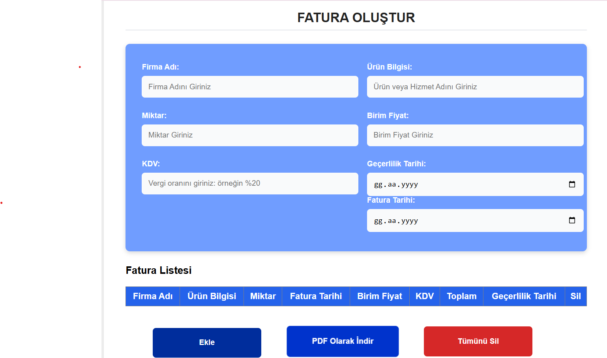
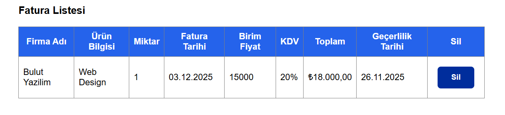
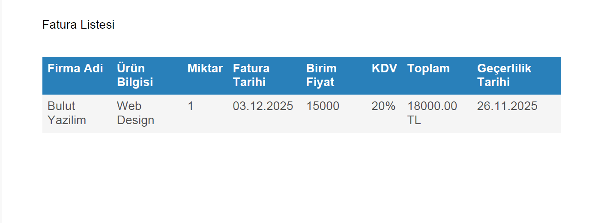

# FATURA OLUŞTURMA UYGULAMASI

- Bu proje, kullanıcıların kolayca fatura oluşturmasını, fatura bilgilerini düzenlemesini, ve PDF olarak dışa aktarmasını sağlayan bir web uygulamasıdır.
- Kullanıcılar oluşturdukları faturaları localStorage üzerinden saklayabilir ve daha sonra tekrar görüntüleyebilir.
- Proje, modern ve sade bir arayüzle tasarlanmıştır ve Figma tasarımı temel alınarak CSS ile kodlanmıştır.

# ÖNE ÇIKAN ÖZELLİKLER:

- Fatura bilgilerini (firma adı, ürün, miktar, fiyat, KDV vb.) girme

- Otomatik toplam ve KDV hesaplama

- Faturaları PDF olarak indirme

- Fatura geçmişini localStorage’da saklama

- Modern ve responsive tasarım

# KULLANILAN TEKNOLOJİLER

- React.js

- jsPDF

- jspdf-autotable

- CSS3

- JavaScript (ES6)

- Figma (UI Tasarımı için)

# KURULUM

1. Projeyi klonla

```bash
git clone https://github.com/gamzefidan/fatura-olusturma-uygulamasi.git
```

2. Proje klasörüne gir

```bash
cd fatura-olusturma-uygulamasi
```

3. Gerekli bağımlılıkları yükle

```bash
npm install
```

4. projeyi çalıştır

```bash
npm start
```

# Kullanım

1. Fatura Ekleme:

- Firma adı, ürün bilgisi, miktar, birim fiyat, KDV oranı ve tarih alanlarını doldur.

- “Fatura Ekle” butonuna tıklayarak faturayı listeye ekle.

2. Fatura Silme:

- Her fatura satırında bulunan “Sil” butonuna tıklayarak ilgili faturayı kaldırabilirsin.

3. Tüm Faturaları Temizleme:

- “Tümünü Temizle” butonuna tıklayarak listedeki tüm faturaları silebilirsin.

4. PDF Olarak İndirme:

- “PDF İndir” butonuna tıklayarak faturaları tablo halinde PDF olarak dışa aktarabilirsin.

# Veri Saklama (LocalStorage)

- Uygulama, kullanıcı tarafından oluşturulan tüm fatura verilerini tarayıcı localStorage alanında saklar.
- Bu sayede sayfa yenilendiğinde veya tarayıcı kapatılıp açıldığında veriler kaybolmaz.
- “Tümünü Temizle” butonuna tıklayarak bu verileri sıfırlayabilirsin.

# PDF Oluşturma Özelliği

- PDF oluşturma işlemi, jsPDF ve jspdf-autotable kütüphaneleri ile gerçekleştirilmiştir.
- PDF çıktısı, oluşturulan faturaların tablo halinde bir dökümünü içerir.

# EKRAN GÖRÜNTÜLERİ




